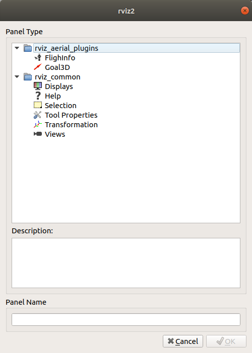
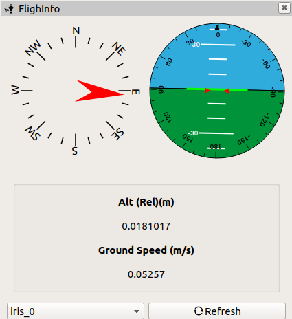
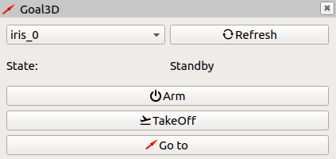
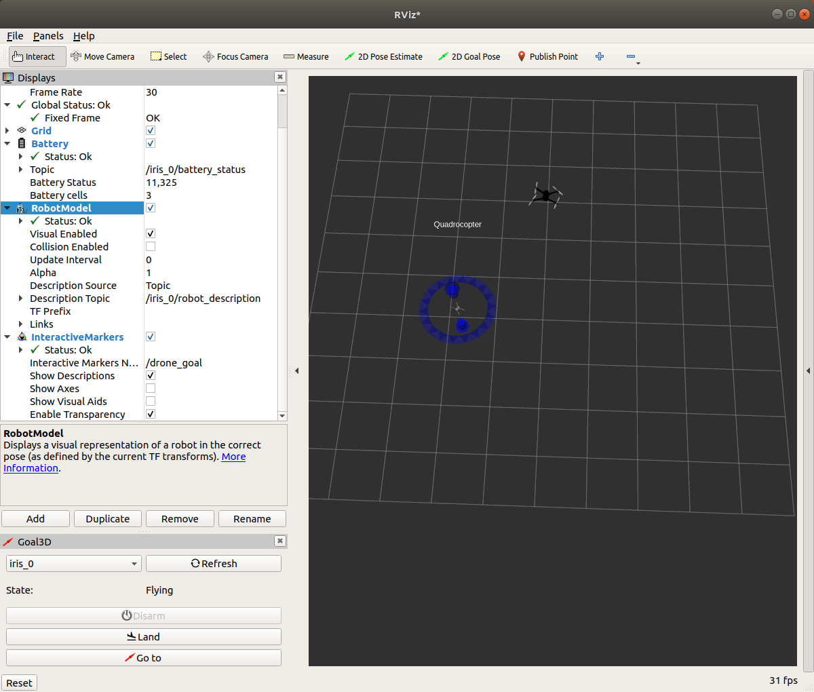
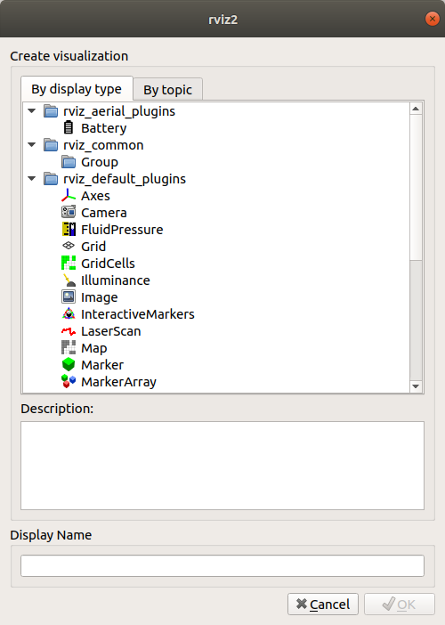
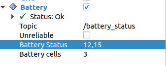

# RViz aerial plugins

These plugins allow to visualize data from the drone such as the battery status, the compass, the attitude display information or the flight information. Or even control the drone, for example, you can arm, disarm, takeoff, go to a 3D point (using geometry_msgs/PoseStamped) or land.

## Plugins

| Displays              | Panels         |
| --------------------- | -------------- |
| Battery               | Compass and ADI|
|                       | 3D Goal        |

## Screenshots

### Panels

You can add the panels using the upper menu: `Panels` -> `Add New Panel`:

  

You can choose in the `rviz_aerial_plugins` between:

#### Flight info: Compass, attitude display information

You can choose using the combobox which drone you want to display:

  

#### Goal 3D

Using this panel you can visualize the current state of the drone. Clicking on the buttons you can arm, disarm, takeoff, land or move to a specific 3D goal.

Add an interactive marker to the display panel and select the topic `/drone_goal`. Then an interactive marker will appear in the 3D visualizer. You can move this marker and clicking in the *Go to*  button the drone will perform the movement.

  

  

### Displays

From Display you can add Battery:

  

#### Battery status

This display will shows the current voltage and the number of cells.

  

